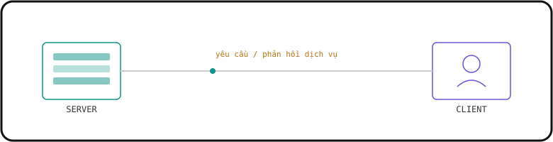
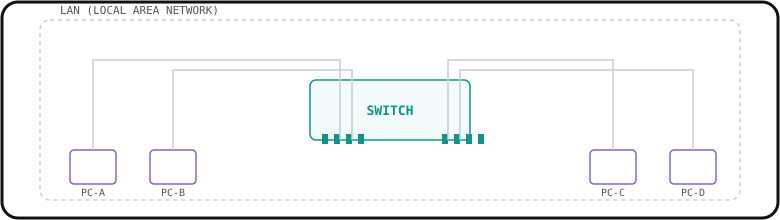
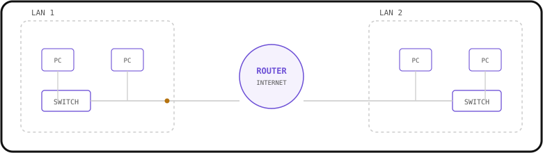
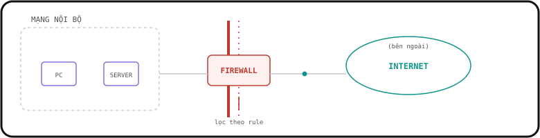

# 1. Network Devices

<iframe width="1337" height="752" src="https://www.youtube.com/embed/H8W9oMNSuwo?list=PLxbwE86jKRgMpuZuLBivzlM8s2Dk5lXBQ" title="Free CCNA | Network Devices | Day 1 | CCNA 200-301 Complete Course" frameborder="0" allow="accelerometer; autoplay; clipboard-write; encrypted-media; gyroscope; picture-in-picture; web-share" referrerpolicy="strict-origin-when-cross-origin" allowfullscreen></iframe>

## Mạng máy tính là gì?

Mạng máy tính (computer network) là một mạng viễn thông kỹ thuật số, cho phép các NÚT MẠNG (NODES) chia sẻ TÀI NGUYÊN (RESOURCES).

MÁY KHÁCH (CLIENT) là thiết bị truy cập một dịch vụ do MÁY CHỦ (SERVER) cung cấp.

MÁY CHỦ (SERVER) là thiết bị cung cấp các chức năng hoặc dịch vụ cho CLIENT.

> **Lưu ý:** Cùng một thiết bị có thể vừa là CLIENT trong tình huống này, vừa là SERVER trong tình huống khác. Ví dụ: mạng ngang hàng (Peer-to-Peer).

{ .network-svg }

---

## SWITCH (Lớp 2)

- Cung cấp kết nối cho các **host** trong cùng một **LAN** (Local Area Network — mạng cục bộ).
- Có **nhiều port** để các thiết bị đầu cuối (End Host) kết nối vào.
- **KHÔNG** cung cấp kết nối giữa các LAN hoặc qua Internet.

{ .network-svg }

---

## ROUTER (Lớp 3)

- Có **ít port hơn switch**.
- Dùng để cung cấp kết nối **GIỮA các LAN**.
- Dùng để **truyền dữ liệu qua Internet**.

{ .network-svg }

---

## FIREWALL (Có thể hoạt động ở Lớp 3, 4 và 7)

- Là thiết bị bảo mật mạng chuyên dụng, kiểm soát lưu lượng mạng **ra/vào** mạng của bạn.
- Có thể đặt **"bên trong"** hoặc **"bên ngoài"** mạng.
- **Giám sát và kiểm soát** lưu lượng mạng dựa trên các quy tắc (rules) được cấu hình.
- Được gọi là **"Next-Generation Firewall"** (Tường lửa thế hệ mới) khi tích hợp các khả năng lọc hiện đại và nâng cao hơn.
- **Host-based firewall** (Tường lửa trên máy chủ) là ứng dụng phần mềm lọc lưu lượng ra/vào một máy đơn lẻ, như PC.

{ .network-svg }
