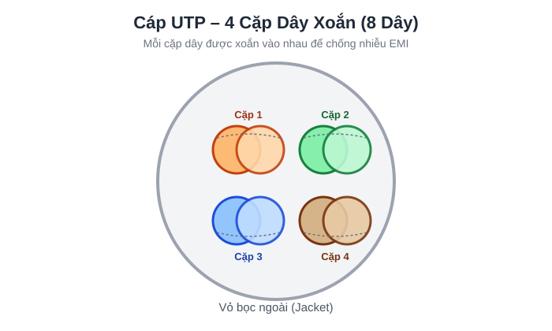
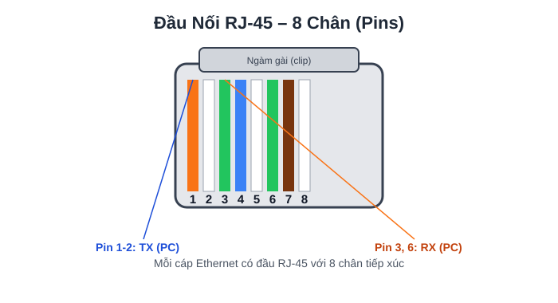
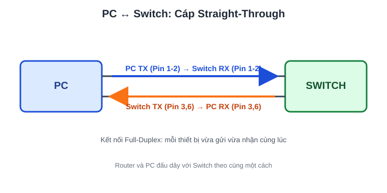
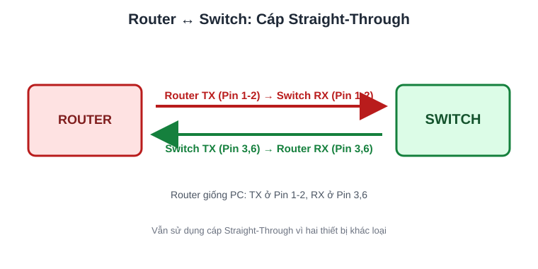
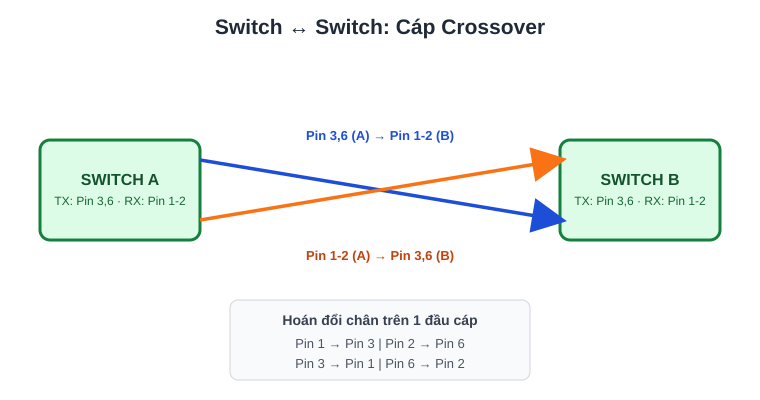
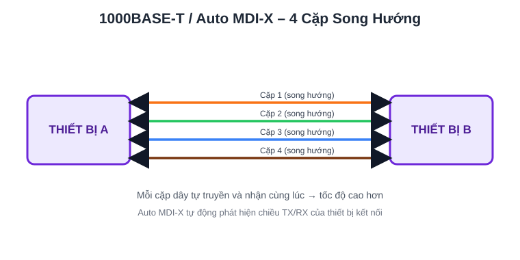
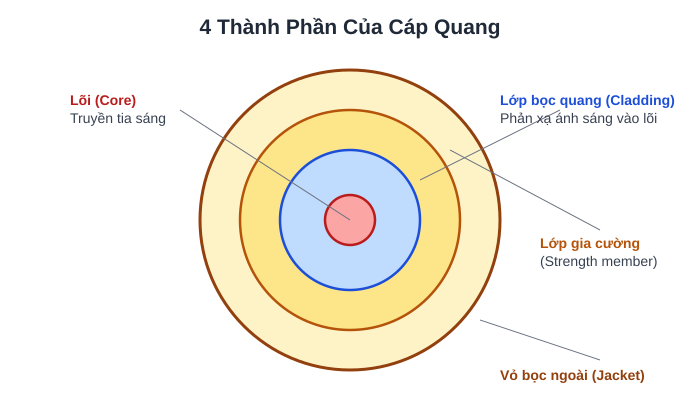
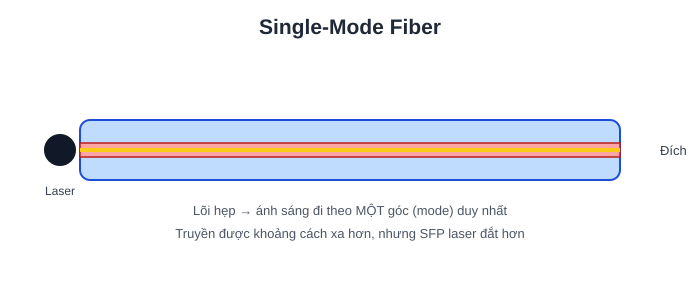
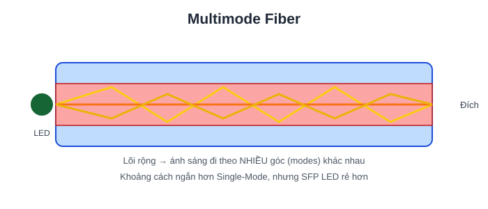

# 2. INTERFACES AND CABLES

SWITCH cung cấp nhiều CỔNG (PORTS) để kết nối (thường là 24 cổng).

Các cổng này thường là cổng **RJ-45** (Registered Jack).

---

## ETHERNET LÀ GÌ?

- Ethernet là một tập hợp các giao thức/tiêu chuẩn mạng.

**Tại sao chúng ta cần các giao thức và tiêu chuẩn mạng?**

- Cung cấp tiêu chuẩn truyền thông chung trên các mạng.
- Cung cấp tiêu chuẩn phần cứng chung để cho phép kết nối giữa các thiết bị.

Kết nối giữa các thiết bị hoạt động ở một TỐC ĐỘ cố định.

Các tốc độ này được đo bằng "bit trên giây" (bps).

Một **bit** có giá trị "0" hoặc "1".
Một **byte** = 8 bit (các số 0 và 1).

| Kích thước | Số Bit |
| --- | --- |
| 1 kilobit (Kb) | 1.000 |
| 1 megabit (Mb) | 1.000.000 |
| 1 gigabit (Gb) | 1.000.000.000 |
| 1 terabit (Tb) | 1.000.000.000.000 |

Tiêu chuẩn Ethernet:

- Được định nghĩa trong tiêu chuẩn **IEEE 802.3** vào năm 1983.
- IEEE = Institute of Electrical and Electronics Engineers (Viện Kỹ sư Điện và Điện tử).

---

## TIÊU CHUẨN ETHERNET (CÁP ĐỒNG)

| Tốc độ | Tên thường gọi | Tiêu chuẩn | Loại cáp | Khoảng cách truyền tối đa |
| --- | --- | --- | --- | --- |
| 10 Mbps | Ethernet | 802.3i | 10BASE-T | Tối đa 100m |
| 100 Mbps | Fast Ethernet | 802.3u | 100BASE-T | Tối đa 100m |
| 1 Gbps | Gigabit Ethernet | 802.3ab | 1000BASE-T | Tối đa 100m |
| 10 Gbps | 10 Gigabit Ethernet | 802.3an | 10GBASE-T | Tối đa 100m |

- **BASE** = Baseband Signaling (Tín hiệu băng gốc).
- **T** = Twisted Pair (Cặp dây xoắn).

Hầu hết Ethernet sử dụng cáp đồng.

**UTP** (Unshielded Twisted Pair) = Cặp dây xoắn không vỏ chống nhiễu (không có lớp kim loại chống nhiễu).
Việc xoắn dây giúp chống lại **EMI** (Electromagnetic Interference – Nhiễu điện từ).

Hầu hết sử dụng 8 dây (4 cặp), tuy nhiên:

- 10/100BASE-T chỉ dùng 2 cặp (4 dây).

{ .network-svg }

---

## CÁC THIẾT BỊ GIAO TIẾP QUA KẾT NỐI NHƯ THẾ NÀO?

Mỗi cáp Ethernet có đầu cắm **RJ-45** với 8 chân (pins) ở hai đầu.

{ .network-svg }

- **PC** truyền (TX) dữ liệu trên chân #1-2.
- **Switch** nhận (RX) dữ liệu trên chân #1-2.
- **PC** nhận (RX) dữ liệu trên chân #3, 6.
- **Switch** truyền (TX) dữ liệu trên chân #3, 6.

Điều này cho phép truyền dữ liệu **Song công (Full-Duplex)**.

{ .network-svg }

---

## NẾU ROUTER / SWITCH KẾT NỐI VỚI NHAU?

{ .network-svg }

- **Router** truyền (TX) dữ liệu trên chân #1-2.
- **Router** nhận (RX) dữ liệu trên chân #3, 6.
- **Switch** truyền (TX) dữ liệu trên chân #3, 6.
- **Switch** nhận (RX) dữ liệu trên chân #1-2.

Router và PC kết nối với Switch theo cùng một cách.

Loại cáp dùng để kết nối được gọi là cáp **"Straight-Through"** (Cáp thẳng).

---

## NẾU MUỐN KẾT NỐI HAI THIẾT BỊ CÙNG LOẠI VỚI NHAU?

**KHÔNG** thể dùng cáp "Straight-Through".
**PHẢI** dùng cáp **"Crossover"** (Cáp chéo).

Loại cáp này hoán đổi các chân ở một đầu để cho phép kết nối hoạt động.

{ .network-svg }

```
PIN#1 -----> PIN#3
PIN#2 -----> PIN#6

PIN#3 -----> PIN#1
PIN#6 -----> PIN#2
```

---

| LOẠI THIẾT BỊ | CHÂN TRUYỀN (TX) | CHÂN NHẬN (RX) |
| --- | --- | --- |
| ROUTER | 1 và 2 | 3 và 6 |
| FIREWALL | 1 và 2 | 3 và 6 |
| PC | 1 và 2 | 3 và 6 |
| SWITCH | 3 và 6 | 1 và 2 |

---

Hầu hết thiết bị hiện đại đều có **AUTO MDI-X**, tự động **phát hiện** chân mà thiết bị kế bên đang dùng để truyền và điều chỉnh chân nhận cho phù hợp.

1000BASE-T / 10GBASE-T = 4 cặp (8 dây).

Mỗi cặp dây là **song hướng (bidirectional)** nên có thể truyền/nhận nhanh hơn nhiều so với 10/100BASE-T.

{ .network-svg }

---

## KẾT NỐI CÁP QUANG (FIBER-OPTIC)

- Được định nghĩa trong tiêu chuẩn **IEEE 802.3ae**.

**SFP Transceiver** (Small Form-Factor Pluggable) cho phép cáp quang kết nối vào switch/router.

- Có các sợi cáp riêng biệt để truyền / nhận.

Cáp quang gồm **4 thành phần**.

{ .network-svg }

Có **HAI loại** cáp quang.

### Single-Mode (Đơn mode)

{ .network-svg }

- Lõi hẹp hơn multimode.
- Ánh sáng đi vào theo MỘT góc (mode) duy nhất từ bộ phát dùng laser.
- Cho phép cáp dài hơn cả UTP và cáp multimode.
- Đắt hơn cáp multimode (do bộ phát SFP dùng laser đắt hơn).

### Multimode (Đa mode)

{ .network-svg }

- Lõi rộng hơn Single-mode.
- Cho phép nhiều góc (modes) ánh sáng đi vào lõi.
- Cho phép cáp dài hơn UTP nhưng ngắn hơn single-mode.
- Rẻ hơn single-mode (do bộ phát SFP dùng LED rẻ hơn).

---

## TIÊU CHUẨN CÁP QUANG

| Tốc độ | Tiêu chuẩn | Tốc độ kết nối | Hỗ trợ Mode | Khoảng cách truyền tối đa |
| --- | --- | --- | --- | --- |
| 1000BASE-LX | 802.3z | 1 Gbps | Multimode / Single | 550m (Multi) / 5km (Single) |
| 10GBASE-SR | 802.3ae | 10 Gbps | Multimode | 400m |
| 10GBASE-LR | 802.3ae | 10 Gbps | Single | 10km |
| 10GBASE-ER | 802.3ae | 10 Gbps | Single | 30km |

---

## SO SÁNH UTP VÀ CÁP QUANG

**UTP:**

- Chi phí thấp hơn cáp quang.
- Khoảng cách tối đa ngắn hơn cáp quang (~100m).
- Dễ bị ảnh hưởng bởi **EMI** (Nhiễu điện từ).
- Cổng RJ-45 dùng với UTP rẻ hơn cổng SFP.
- Phát ra (rò rỉ) tín hiệu yếu ra bên ngoài cáp, có thể bị sao chép (rủi ro bảo mật).

**Cáp quang:**

- Chi phí cao hơn UTP.
- Khoảng cách tối đa dài hơn UTP.
- Không bị ảnh hưởng bởi EMI.
- Cổng SFP đắt hơn cổng RJ-45 (single-mode đắt hơn multimode).
- Không phát ra tín hiệu ra ngoài cáp (không có rủi ro bảo mật).
