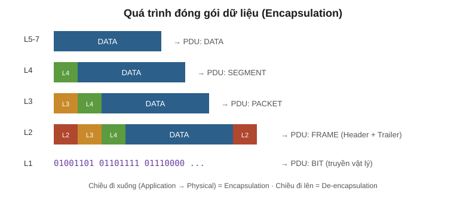
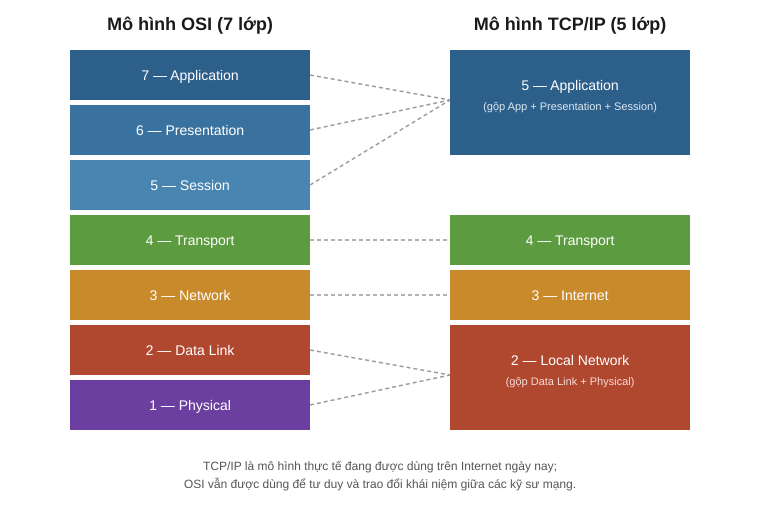

# TCP/IP và OSI Model — Tài liệu tổng hợp (CCNA)

> Tài liệu này gộp lại ghi chép cũ (chi tiết mô hình OSI 7 lớp) và nội dung buổi học mới về mô hình TCP/IP 5 lớp, trình bày lại theo một mạch thống nhất, dùng thuật ngữ kỹ thuật chuẩn tiếng Việt.

---

## 1. Giao thức và chuẩn mạng là gì?

**Giao thức (Protocol)** là tập hợp các quy tắc logic quy định cách các thiết bị và phần mềm mạng phải hoạt động và giao tiếp với nhau.

**Chuẩn (Standard)** là các quy ước được thống nhất rộng rãi để đảm bảo thiết bị của nhiều hãng khác nhau có thể tương tác được với nhau (interoperability). Nếu không có chuẩn chung, mỗi hãng sẽ tự làm theo cách riêng và mạng của các hãng khác nhau sẽ không thể nói chuyện được với nhau.

## 2. Sơ lược lịch sử

Các mô hình mạng hiện nay là kết quả của nhiều thập kỷ phát triển, bắt đầu từ các dự án nghiên cứu quân sự và học thuật (đặc biệt là ARPANET của Bộ Quốc phòng Mỹ) vào cuối những năm 1960 – 1970. Nhu cầu cho các máy tính khác hãng, khác kiến trúc có thể giao tiếp được với nhau đã dẫn đến việc hình thành các bộ giao thức chuẩn hoá, trong đó nổi bật nhất là bộ giao thức TCP/IP.

## 3. Ai định nghĩa các chuẩn?

Các chuẩn mạng được xây dựng và duy trì bởi nhiều tổ chức quốc tế, ví dụ:

- **ISO** (International Organization for Standardization) — tổ chức đã xây dựng mô hình OSI.
- **IETF** (Internet Engineering Task Force) — chịu trách nhiệm phát triển các chuẩn dùng trên Internet (thông qua các tài liệu RFC).
- **IEEE** (Institute of Electrical and Electronics Engineers) — chuẩn hoá các công nghệ tầng vật lý và tầng liên kết dữ liệu (ví dụ Ethernet, Wi-Fi).

## 4. Mô hình phân lớp (Layered Model) là gì?

Một mô hình phân lớp chia nhỏ một hệ thống phức tạp (như truyền thông mạng) thành nhiều lớp (layer) nhỏ hơn, mỗi lớp đảm nhiệm một chức năng riêng biệt. Việc này giúp:

- Dễ thiết kế, dễ học, dễ khắc phục sự cố (troubleshoot theo từng lớp).
- Các lớp có thể phát triển độc lập với nhau, miễn là giao diện giữa các lớp không đổi.
- Nhiều hãng có thể cùng phát triển sản phẩm cho từng lớp riêng mà vẫn tương thích với nhau.

### Ẩn dụ: gửi một lá thư

Khi gửi thư, bạn viết nội dung (lớp trên cùng), sau đó cho vào phong bì và ghi địa chỉ (thêm một "lớp" đóng gói), rồi bưu điện xử lý và vận chuyển vật lý (lớp dưới cùng). Người nhận sẽ làm ngược lại: mở phong bì rồi mới đọc nội dung. Đây chính là ý tưởng của encapsulation/de-encapsulation.

### Ẩn dụ: xây dựng một mô hình

Giống như xây nhà theo bản thiết kế chuẩn, mỗi tầng nhà (layer) được xây dựng dựa trên nền tảng của tầng bên dưới và chỉ cần biết "giao diện" kết nối với tầng liền kề, không cần biết chi tiết bên trong tầng đó hoạt động ra sao.

### Ẩn dụ: sự phân tách các lớp (separation of layers)

Nhờ các lớp được tách biệt rõ ràng, một lớp có thể thay đổi công nghệ bên trong (ví dụ đổi từ cáp đồng sang cáp quang ở lớp vật lý) mà không ảnh hưởng đến cách các lớp phía trên hoạt động.

---

## 5. Mô hình TCP/IP (5 lớp)

Mô hình TCP/IP là mô hình khái niệm và tập hợp giao thức truyền thông thực sự được dùng trên Internet và hầu hết các mạng hiện đại ngày nay. Nó có cấu trúc tương tự OSI nhưng gộp lại còn 5 lớp (một số tài liệu trình bày TCP/IP chỉ với 4 lớp bằng cách gộp Physical và Local Network làm một — xem mục 11).

### Lớp 1 — Physical (Vật lý)

Quy định các đặc tính vật lý của môi trường truyền dẫn: mức điện áp, khoảng cách truyền tối đa, loại đầu nối, thông số cáp... Dữ liệu số (bit 0/1) được chuyển thành tín hiệu điện (cáp đồng) hoặc tín hiệu vô tuyến (không dây) để truyền đi.

### Lớp 2 — Local Network (Mạng cục bộ / Data Link)

Chịu trách nhiệm truyền dữ liệu giữa các thiết bị trong cùng một mạng cục bộ (node-to-node), ví dụ PC–Switch, Switch–Router. Định dạng dữ liệu để truyền qua môi trường vật lý, phát hiện (và có thể sửa) lỗi ở tầng vật lý, sử dụng địa chỉ Lớp 2 (địa chỉ MAC) riêng biệt với địa chỉ Lớp 3. **Switch** hoạt động ở lớp này.

### Lớp 3 — Internet (Mạng)

Cung cấp khả năng kết nối giữa các host nằm trên các mạng khác nhau (ngoài phạm vi LAN). Cung cấp đánh địa chỉ logic (địa chỉ IP) và lựa chọn đường đi (routing) giữa nguồn và đích. **Router** hoạt động ở lớp này.

### Lớp 4 — Transport (Vận chuyển)

Phân đoạn (segment) dữ liệu lớn thành các đoạn nhỏ hơn để dễ truyền qua mạng và giảm rủi ro khi có lỗi truyền dẫn, đồng thời tái hợp (reassemble) lại ở phía nhận. Cung cấp giao tiếp end-to-end (host-to-host) giữa nguồn và đích.

### Lớp 5 — Application (Ứng dụng)

Trong mô hình TCP/IP, lớp Application gộp chung chức năng của 3 lớp trên cùng của OSI (Application, Presentation, Session). Đây là lớp gần người dùng cuối nhất, tương tác trực tiếp với các phần mềm ứng dụng. HTTP/HTTPS là các giao thức hoạt động ở lớp này.

> Nhìn chung, kỹ sư mạng (network engineer) ít khi làm việc trực tiếp với các lớp trên cùng (tương đương Application/Presentation/Session của OSI) — đây là phạm vi công việc chính của lập trình viên ứng dụng (application developer).

---

## 6. Đóng gói và mở gói dữ liệu (Encapsulation & De-encapsulation)

Khi dữ liệu đi từ lớp trên xuống lớp dưới để chuẩn bị truyền đi, mỗi lớp sẽ thêm phần header (và ở Lớp 2 có thêm trailer) riêng của mình vào trước dữ liệu — quá trình này gọi là **Encapsulation**.

Khi dữ liệu đến nơi nhận và đi từ lớp dưới cùng (Physical) lên lớp trên cùng (Application), từng lớp sẽ tuần tự gỡ bỏ phần header/trailer tương ứng của lớp đó — quá trình này gọi là **De-encapsulation**.

## 7. Protocol Data Unit (PDU)

PDU là đơn vị dữ liệu ở mỗi bước của quá trình đóng gói. Tên gọi PDU thay đổi tuỳ theo lớp mà dữ liệu đang ở:

| Lớp OSI | Tên PDU | Dữ liệu được thêm vào |
| --- | --- | --- |
| 7–5 (Application) | DATA | Dữ liệu gốc |
| 4 (Transport) | SEGMENT | Thêm Header Lớp 4 |
| 3 (Network) | PACKET | Thêm Header Lớp 3 |
| 2 (Data Link) | FRAME | Thêm Header và Trailer Lớp 2 |
| 1 (Physical) | BIT | Chuyển thành chuỗi bit 0/1 để truyền |

Cấu trúc một Frame hoàn chỉnh: `L2 Trailer + DATA + L4 Header + L3 Header + L2 Header`

## 8. Tương tác lớp liền kề & tương tác cùng lớp

**Tương tác lớp liền kề (Adjacent-layer interaction):**
Là sự tương tác giữa các lớp khác nhau nhưng trên cùng một thiết bị (host). Ví dụ: các Lớp 5–7 gửi dữ liệu xuống Lớp 4, Lớp 4 thêm Header Lớp 4 vào để tạo thành một Segment.

**Tương tác cùng lớp (Same-layer interaction):**
Là sự tương tác giữa cùng một lớp nhưng trên hai thiết bị khác nhau. Khái niệm này cho phép ta "bỏ qua" các lớp khác và chỉ tập trung vào tương tác của một lớp cụ thể giữa hai bên. Ví dụ: Lớp Application của server YouTube và Lớp Application của trình duyệt trên máy tính của bạn "nói chuyện" trực tiếp với nhau (về mặt logic), dù dữ liệu thực tế vẫn phải đi qua toàn bộ chồng giao thức (protocol stack) ở cả hai phía.

---

## 9. Mô hình OSI (7 lớp)

**OSI (Open Systems Interconnection)** là mô hình khái niệm phân loại và chuẩn hoá các chức năng khác nhau trong một mạng máy tính, do tổ chức **ISO** xây dựng. Chức năng mạng được chia thành 7 lớp, các lớp phối hợp với nhau để mạng hoạt động được. Dù ngày nay mạng thực tế vận hành theo mô hình TCP/IP, OSI vẫn ảnh hưởng lớn đến cách kỹ sư mạng tư duy và trao đổi khái niệm.

### 7 — Application

Lớp gần người dùng cuối nhất, tương tác với các phần mềm ứng dụng. HTTP và HTTPS là các giao thức Lớp 7. Chức năng chính: định danh đối tác giao tiếp, đồng bộ hoá giao tiếp.

### 6 — Presentation

Chuyển đổi dữ liệu sang định dạng phù hợp (giữa định dạng ứng dụng và định dạng mạng) để có thể truyền qua mạng.

### 5 — Session

Điều khiển các phiên (session) hội thoại giữa các host giao tiếp với nhau: thiết lập, quản lý và kết thúc kết nối giữa ứng dụng cục bộ và ứng dụng ở xa.

> Kỹ sư mạng thường không làm việc trực tiếp với 3 lớp trên cùng này; đây là phạm vi của lập trình viên ứng dụng.

### 4 — Transport

Phân đoạn và tái hợp dữ liệu để giao tiếp giữa các host đầu cuối. Chia nhỏ dữ liệu lớn thành các segment để dễ truyền và ít gây lỗi hơn. Cung cấp giao tiếp host-to-host (end-to-end). Khi dữ liệu từ Lớp 7-5 đến, nó nhận thêm Header Lớp 4 → tạo thành **SEGMENT**.

### 3 — Network

Cung cấp kết nối giữa các host ở các mạng khác nhau (ngoài LAN). Cung cấp đánh địa chỉ logic (địa chỉ IP) và lựa chọn đường đi giữa nguồn và đích. **Router** hoạt động ở lớp này. Segment nhận thêm Header Lớp 3 → tạo thành **PACKET**.

### 2 — Data Link

Cung cấp kết nối và truyền dữ liệu node-to-node (ví dụ PC–Switch, Switch–Router, Router–Router). Định dạng dữ liệu để truyền qua môi trường vật lý, phát hiện (và có thể sửa) lỗi Lớp 1, dùng địa chỉ Lớp 2 riêng biệt với địa chỉ Lớp 3. **Switch** hoạt động ở lớp này. Packet nhận thêm Header và Trailer Lớp 2 → tạo thành **FRAME**.

### 1 — Physical

Quy định đặc tính vật lý của môi trường truyền dữ liệu: mức điện áp, khoảng cách truyền tối đa, loại đầu nối, thông số cáp. Bit số được chuyển thành tín hiệu điện (kết nối có dây) hoặc tín hiệu vô tuyến (không dây).

---

## 10. So sánh OSI và TCP/IP

| Tiêu chí | OSI | TCP/IP |
| --- | --- | --- |
| Số lớp | 7 | 5 (hoặc 4 tuỳ cách trình bày) |
| Nguồn gốc | Do ISO xây dựng, mang tính lý thuyết/khái niệm | Do DARPA (Bộ Quốc phòng Mỹ) phát triển, dùng thực tế |
| Vai trò hiện nay | Khung tư duy, dùng để trao đổi khái niệm giữa kỹ sư mạng | Mô hình thực sự đang vận hành trên Internet |
| Application/Presentation/Session | 3 lớp riêng biệt | Gộp chung thành 1 lớp Application |
| Data Link/Physical | 2 lớp riêng biệt | Gộp chung thành 1 lớp Local Network (ở bản 4 lớp) |

## 11. Các phiên bản khác của mô hình TCP/IP

Ngoài phiên bản 5 lớp (Physical, Local Network, Internet, Transport, Application) trình bày ở trên, một số tài liệu — đặc biệt là tài liệu gốc từ DARPA — trình bày TCP/IP chỉ với **4 lớp**, bằng cách gộp luôn Physical và Data Link thành một lớp duy nhất gọi là **Network Access** (hoặc Network Interface). Về bản chất chức năng không đổi, chỉ khác cách nhóm các lớp lại với nhau. Đây là lý do vì sao khi đọc các tài liệu khác nhau, số lớp của TCP/IP có thể được ghi là 4 hoặc 5.

## 12. Tổng kết

- Mô hình phân lớp giúp chuẩn hoá, đơn giản hoá việc thiết kế và khắc phục sự cố mạng.
- **TCP/IP** là mô hình đang thực sự vận hành trên Internet và hầu hết mạng hiện đại; **OSI** vẫn là khung khái niệm quan trọng để kỹ sư mạng tư duy và giao tiếp.
- Dữ liệu di chuyển xuống chồng giao thức thông qua **encapsulation** (thêm header/trailer ở mỗi lớp) và di chuyển lên thông qua **de-encapsulation**.
- Mỗi lớp có PDU riêng: Data → Segment → Packet → Frame → Bit.
- Có hai kiểu tương tác giữa các lớp: **adjacent-layer** (giữa các lớp khác nhau, cùng thiết bị) và **same-layer** (cùng lớp, khác thiết bị).
- Router hoạt động ở Lớp 3 (Network/Internet); Switch hoạt động ở Lớp 2 (Data Link/Local Network).
