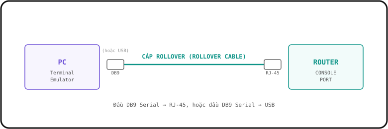
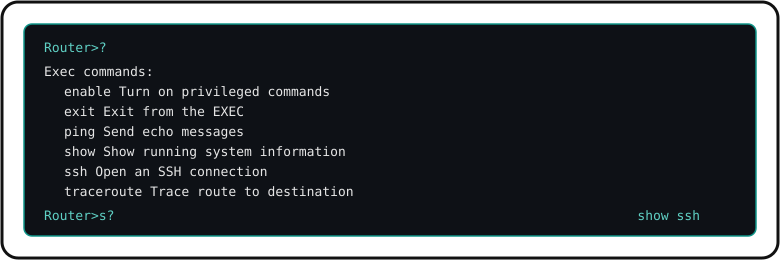

# 4. GIỚI THIỆU VỀ CLI

### CLI là gì?

- Viết tắt của "Command-line Interface" (Giao diện dòng lệnh).
- Là giao diện bạn dùng để cấu hình các thiết bị Cisco.

GUI là "Graphical User Interface" (Giao diện đồ hoạ người dùng).

---

### Làm thế nào để kết nối vào một thiết bị Cisco?

- **Console Port**: Khi cấu hình thiết bị lần đầu tiên, bạn PHẢI kết nối qua Cổng Console.

Bạn có thể dùng cáp **"Rollover"**: đầu nối DB9 Serial sang RJ-45, HOẶC đầu nối DB9 Serial sang USB.



---

### Làm sao để thực sự truy cập vào CLI?

- Bạn cần dùng một **TRÌNH GIẢ LẬP TERMINAL** (Terminal Emulator) — ví dụ: **PuTTY** là lựa chọn phổ biến — và kết nối qua kiểu **"Serial"** (dùng thông số mặc định).

### Thông số mặc định của Cisco:

| Thông số | Giá trị |
| --- | --- |
| Speed (baud) | 9600 bit/giây |
| Data bits | 8 data bit |
| Stop bits | 1 stop bit (gửi sau khi 8 data bit đã được truyền) |
| Parity | None (không) |
| Flow Control | None (không) |

---

## CÁC CHẾ ĐỘ TRONG CLI

Khi vào CLI lần đầu, bạn sẽ **MẶC ĐỊNH** ở chế độ gọi là **"User EXEC"**.

### USER EXEC MODE (Chế độ User EXEC)

```
(Hostname) >        // Prompt trông như THẾ NÀY //
```

- Chế độ User EXEC rất hạn chế.
- Người dùng có thể xem một số thông tin nhưng **KHÔNG** thể thay đổi bất kỳ cấu hình nào.
- Còn gọi là **"User Mode"**.

Dùng lệnh **`enable`** trong chế độ User EXEC sẽ chuyển bạn sang chế độ **"Privileged EXEC"**.

---

### PRIVILEGED EXEC MODE (Chế độ Privileged EXEC)

- Cho phép truy cập đầy đủ để xem cấu hình thiết bị, khởi động lại thiết bị, v.v.
- Không thể thay đổi cấu hình, nhưng có thể chỉnh thời gian trên thiết bị, lưu file cấu hình, v.v.

```
(Hostname) #        // Prompt trông như THẾ NÀY //
```

---

**DÙNG** dấu chấm hỏi (`?`) để xem các lệnh khả dụng ở **BẤT KỲ** chế độ nào. Kết hợp `?` với một chữ cái hoặc lệnh gõ dở sẽ liệt kê tất cả các lệnh bắt đầu bằng những chữ cái đó.



**DÙNG** phím **TAB** để hoàn thành một lệnh đang gõ dở, **NẾU** lệnh đó tồn tại.

---

### CHẾ ĐỘ GLOBAL CONFIGURATION

Để vào **Global Configuration Mode**, nhập lệnh sau trong chế độ Privileged EXEC:

`configure terminal` (hoặc `conf t`)

```
Router# configure terminal
```

Chú ý prompt thay đổi:

```
Router(config)#
```

Gõ **`exit`** để quay lại chế độ **"Privileged EXEC"**.

---

## MẬT KHẨU VÀ MÃ HOÁ

### Đặt mật khẩu (Enable Password) cho chế độ User EXEC:

```
Router(config)# enable password (mật khẩu)
```

- Mật khẩu **CÓ** phân biệt chữ hoa/thường (case-sensitive).

Lệnh dưới đây mã hoá các mật khẩu dạng văn bản thuần (plain-text) — vốn hiển thị rõ trong file cấu hình — bằng một kiểu mã hoá đơn giản:

```
Router(config)# service password-encryption
```

**Nếu BẬT** `service password-encryption`:

- Các mật khẩu hiện tại **SẼ** được mã hoá.
- Các mật khẩu trong tương lai **SẼ** được mã hoá.
- `enable secret` **SẼ KHÔNG** bị ảnh hưởng.

**Nếu TẮT** `service password-encryption`:

- Các mật khẩu hiện tại **SẼ KHÔNG** được giải mã.
- Các mật khẩu trong tương lai **SẼ KHÔNG** được mã hoá.
- `enable secret` **SẼ KHÔNG** bị ảnh hưởng.

Lệnh dưới đây bật mật khẩu cho chế độ Privileged EXEC:

```
Router(config)# enable secret (mật khẩu)
```

> **Lưu ý:** `enable secret` sẽ **LUÔN** được mã hoá (ở cấp độ 5).

---

## RUNNING-CONFIG VÀ STARTUP-CONFIG

Có **HAI** file cấu hình riêng biệt được lưu trên thiết bị cùng lúc.

**Running-config:**

- Là file cấu hình hiện tại, **ĐANG HOẠT ĐỘNG** trên thiết bị. Khi bạn nhập lệnh trong CLI, bạn đang chỉnh sửa chính cấu hình đang hoạt động này.

**Startup-config:**

- Là file cấu hình sẽ được nạp khi thiết bị **KHỞI ĐỘNG LẠI**.

Để xem các file cấu hình, trong chế độ **"Privileged EXEC"**:

```
Router# show running-config    // xem running-config //
```

HOẶC

```
Router# show startup-config    // xem startup-config //
```

---

## LƯU CẤU HÌNH

Để **LƯU** file running-config, bạn có thể dùng một trong các cách sau:

```
Router# write
Building configuration...
[OK]
```

```
Router# write memory
Building configuration...
[OK]
```

```
Router# copy running-config startup-config

Destination filename [startup-config]?

Building configuration...
[OK]
```

---

## VÍ DỤ: MÃ HOÁ MẬT KHẨU

Để mã hoá mật khẩu:

```
Router# conf t
Router(config)# service password-encryption
```

Lệnh này khiến **tất cả** mật khẩu hiện tại trở thành **mã hoá**.

Các mật khẩu trong tương lai cũng **SẼ** được mã hoá.

`enable secret` sẽ không bị ảnh hưởng (vì nó **LUÔN** được mã hoá sẵn).

```
Router(config)# do show running-config | include password
enable password 7 03095A0A17
line con 0
 password 7 070C285F4D08
line vty 0 4
 password 7 121A0C041104
```

Bây giờ bạn sẽ thấy mật khẩu **không còn** ở dạng văn bản thuần (plaintext) nữa.

- **"7"** ám chỉ loại mã hoá được dùng. Trong trường hợp này, **"7"** là kiểu mã hoá độc quyền (proprietary) của Cisco.
- **"7"** khá dễ bị bẻ khoá (crack) vì thuật toán mã hoá yếu.

Để có mã hoá **TỐT HƠN / MẠNH HƠN**, dùng `enable secret`:

```
Router(config)# do show running-config | include secret
enable secret 5 $1$mERr$hx5rVt7rPNoS4wqbXKX7m0
```

- **"5"** ám chỉ mã hoá **MD5**.
- Vẫn có thể bị bẻ khoá, nhưng mạnh hơn rất nhiều so với loại "7".
- Một khi đã dùng lệnh `enable secret`, nó sẽ **ghi đè (override)** `enable password`.

---

## HUỶ MỘT LỆNH VỚI TỪ KHOÁ "no"

Để **HUỶ** hoặc xoá một lệnh đã nhập, dùng từ khoá **`no`**:

```
Router(config)# no service password-encryption
```

Trong trường hợp này, khi **tắt** `service password-encryption`:

- Các mật khẩu hiện tại **sẽ KHÔNG** được giải mã (giữ nguyên trạng thái đã mã hoá).
- Các mật khẩu trong tương lai **sẽ KHÔNG** được mã hoá.
- `enable secret` sẽ **không** bị ảnh hưởng.

---

## TỔNG KẾT

- **CLI** (Command-line Interface) là giao diện chính để cấu hình thiết bị Cisco, truy cập lần đầu qua **Console Port** bằng cáp Rollover.
- CLI có 3 chế độ chính đã học: **User EXEC** (`>`), **Privileged EXEC** (`#`), và **Global Configuration** (`(config)#`).
- Dùng `?` để xem trợ giúp, dùng **TAB** để tự hoàn thành lệnh.
- `enable password` đặt mật khẩu cho User EXEC; `enable secret` đặt mật khẩu cho Privileged EXEC và luôn được mã hoá bằng MD5 (cấp độ 5), mạnh hơn `service password-encryption` (cấp độ 7).
- Thiết bị luôn có **running-config** (đang chạy) và **startup-config** (nạp khi khởi động lại) — dùng `write` hoặc `copy running-config startup-config` để lưu.
- Dùng từ khoá `no` trước một lệnh để huỷ/xoá cấu hình đó.
